# Notion Task Manager Telegram Mini App

A Telegram bot that serves only for one user (its me hahaha) and allows to create and manage tasks in Notion databases directly from Telegram.

**🎯 [Quick Start](QUICKSTART.md)** | **🧪 [Testing](TESTING.md)** | **🚀 [Deployment](DEPLOYMENT.md)** | **🔧 [Troubleshooting](TROUBLESHOOTING.md)**

## Features

- **Reaction-based task creation**: Send message → add reaction → task created (no confirmation spam!)
- **AI-powered task tagging**: Automatically categorizes tasks using Gemini AI (link/journal/date/task)
- **Smart daily reminders**: Get notified at 11 PM about:
  - Tasks with deadlines but no date set
  - Journal entries that should be moved to journal database
  - Link-only tasks that need proper descriptions
- Bot confirms with ✅ reaction when task is saved
- View and manage tasks through mini-app interface
- Support for multiple Notion databases (tasks, notes, journal, projects)
- Webhook integration for real-time reactions
- Secure: restricted to authorized user only

## How It Works

### Architecture

```mermaid
graph TB
    User[User in Telegram]
    Bot[Telegram Bot]
    Webhook[Webhook Endpoint]
    Notion[Notion API]
    Gemini[Gemini AI]
    Memory[In-Memory Storage]
    DB[SQLite Database]
    Scheduler[Daily Scheduler]
    
    User -->|1. Sends message| Bot
    Bot -->|2. Store in pending tasks| Memory
    User -->|3. Adds reaction 👍| Webhook
    Webhook -->|4. Check pending tasks| Memory
    Webhook -->|5. Create task| Notion
    Notion -->|6. Return task ID| Webhook
    Webhook -->|7. Tag task| Gemini
    Gemini -->|8. Return tag| Webhook
    Webhook -->|9. Store metadata| DB
    Webhook -->|10. Add ✅ reaction| User
    Scheduler -->|11 PM daily| DB
    Scheduler -->|Check tasks| Notion
    Scheduler -->|Send reminders| User
```



### Creating Tasks (Reaction-Based)

1. **Send a message** to the bot (e.g., "Buy groceries")
   - Bot silently saves it to memory (no response!)
   - You can **edit the message** anytime before adding reaction
2. **Add 👍 reaction** to your message when ready
   - Bot shows ✍️ (processing)
   - Retries up to 3 times if needed
3. **Result:**
   - ✅ = Task created successfully
   - 😢 = Failed after 3 attempts

**Benefits:**
- ✅ No spam in chat (no "yes/no" confirmations)
- ✅ Edit messages before confirming
- ✅ Only 👍 triggers processing (other reactions ignored)
- ✅ Automatic retries on errors

1. Simply send any text message to the bot
2. Add a reaction (any emoji) to your message
3. The bot will create a task in Notion with your message as the title
4. Once created, the bot adds a ✅ reaction to confirm

**Note**: Messages without reactions won't be added to Notion, keeping your chat clean!

### AI-Powered Task Management

When you create a task, the bot automatically:
1. **Tags it with AI**: Uses Gemini 2.0 Flash Lite to categorize as:
   - `link` - Just a URL/link
   - `journal` - Personal thoughts, emotions, observations
   - `date` - Mentions a deadline, date, OR any university/academic work (including Software Engineering topics like highload, data analysis, algorithms, databases, ITMO University subjects, labs, assignments, exams)
   - `task` - Regular task
   - **Tag is stored in Notion's `llm_tag` property**

2. **Daily Check (11 PM)**: Reviews ALL non-done tasks (without `sometimes-later` tag) and sends reminders:
   - ⏰ **Date tasks without dates**: "You mentioned a deadline but didn't set a date"
   - 📔 **Journal entries**: "This looks like a journal entry, consider moving it"
   - 🔗 **Link-only tasks**: "Please give this link a descriptive name"

**Benefits:**
- Never forget to add dates to time-sensitive tasks (especially university work)
- Keep your task database clean and organized
- Automatic suggestions for better task management
- All metadata stored directly in Notion (no local database needed)

### Managing Tasks

Use the "Open Mini App" button to:
- View recent tasks
- Update task properties
- Mark tasks as complete
- Access different databases (tasks/notes)

## Prerequisites

- Go 1.21 or higher
- Telegram Bot Token
- Notion API Key
- Notion Database IDs (tasks and/or notes)
- Gemini API Key (for AI task tagging)

## Setup

1. Clone the repository
2. Create a `.env` file with the following variables:
   ```
   TELEGRAM_BOT_TOKEN=your_telegram_bot_token
   NOTION_API_KEY=your_notion_api_key
   NOTION_TASKS_DATABASE_ID=your_tasks_database_id
   NOTION_NOTES_DATABASE_ID=your_notes_database_id
   MINI_APP_URL=https://your-domain.com/notion/mini-app
   AUTHORIZED_USER_ID=your_telegram_user_id
   WEBHOOK_URL=https://your-domain.com/telegram/webhook
   GEMINI_API_KEY=your_gemini_api_key
   DATABASE_PATH=./data/tasks.db
   ```
3. Install dependencies:
   ```bash
   go mod download
   ```
4. Run the application:
   ```bash
   go run cmd/main.go
   ```
5. **Setup Telegram Webhook** (required for reactions to work):
   
   **Easy way** (using the provided script):
   ```bash
   ./setup-webhook.sh
   ```
   
   **Manual way**:
   ```bash
   curl -X POST "https://api.telegram.org/bot<YOUR_BOT_TOKEN>/setWebhook" \
     -H "Content-Type: application/json" \
     -d '{"url":"https://your-domain.com/telegram/webhook","allowed_updates":["message","message_reaction"]}'
   ```

### Important Notes

- **Reactions require webhooks**: Telegram Bot API only sends message reactions via webhooks, not through long polling
- **Use the same domain**: Your webhook URL should be on the same domain as your mini-app
  - Example: If `MINI_APP_URL=https://tralalero-tralala.ru/notion/mini-app`
  - Then `WEBHOOK_URL=https://tralalero-tralala.ru/telegram/webhook`
- The bot uses long polling for regular messages and webhooks for reactions
- Make sure your webhook URL is publicly accessible via HTTPS
- You can get your Telegram User ID by messaging [@userinfobot](https://t.me/userinfobot)

## Project Structure

```
.
├── cmd/
│   └── main.go           # Application entry point
├── internal/
│   ├── bot/             # Telegram bot handlers
│   └── notion/          # Notion API integration
├── web/                 # Frontend for Telegram mini app
│   ├── index.html       # HTML structure
│   ├── app.js           # JavaScript functionality
│   └── styles.css       # Styling
├── .env                 # Environment variables
├── go.mod              # Go module file
└── README.md           # Project documentation
```

## Multiple Database Support

The app supports both tasks and notes databases:

1. Configure both database IDs in the `.env` file
2. Switch between databases using the tabs in the UI
3. Each database can have its own unique properties

## Error Handling

The app includes robust error handling to ensure reliability:
1. User-friendly error messages
2. Graceful handling of API limitations
3. Clean recovery from network issues

## Development

The project uses:
- Go for the backend
- Telegram Bot API for bot interactions
- Notion API for database operations
- HTML/CSS/JavaScript for the mini app frontend

## Deployment

### Docker (Recommended for Production)

```bash
# Build and run with Docker
make docker-build
make docker-run

# Check status
make docker-status

# View logs
make docker-logs

# Stop container
make docker-stop
```

**Troubleshooting:** If container doesn't start, see [Docker Troubleshooting Guide](DOCKER-TROUBLESHOOTING.md)

### Manual Setup

A simple nginx setup script is included to help with deployment:

```bash
./nginx-setup.sh
```

This will set up the necessary configuration for serving the mini app through Nginx.

### Available Scripts

| Script | Purpose |
|--------|--------|
| `setup-webhook.sh` | Configure Telegram webhook for reactions |
| `delete-webhook.sh` | Remove webhook and switch to polling |
| `add-webhook-to-nginx.sh` | Add webhook endpoint to existing nginx |
| `diagnose-webhook.sh` | Diagnose webhook connectivity issues |
| `start-production.sh` | Start bot with validation checks |
| `nginx-setup.sh` | Full nginx configuration setup |

**Quick Commands:**
```bash
# Start in production mode (with checks)
./start-production.sh

# Diagnose webhook issues
./diagnose-webhook.sh

# Setup webhook
./setup-webhook.sh
```

## License

MIT 