# Notion Task Manager Telegram Mini App

A Telegram bot that serves only for one user (its me hahaha) and allows to create and manage tasks in Notion databases directly from Telegram.

**🎯 [Quick Start Guide](QUICKSTART.md)** | **📝 [Testing Guide](TESTING.md)** | **🚀 [Deployment Guide](DEPLOYMENT.md)** | **📋 [Changelog](CHANGELOG.md)**

## Features

- **Reaction-based task creation**: Send a message and react with 👍 to create a task (no confirmation dialogs!)
- Bot confirms task creation by adding its own ✅ reaction
- View and manage existing tasks through the mini app
- Seamless integration with Telegram
- Support for multiple database types (tasks and notes)
- Graceful handling of button properties in Notion databases
- Streamlined, simplified interface for reliable performance
- Reduced chat spam - no "yes/no" confirmation messages

## How It Works

### Architecture

```mermaid
graph TB
    User[User in Telegram]
    Bot[Telegram Bot]
    Webhook[Webhook Endpoint]
    Notion[Notion API]
    Memory[In-Memory Storage]
    
    User -->|1. Sends message| Bot
    Bot -->|2. Store in pending tasks| Memory
    User -->|3. Adds reaction| Webhook
    Webhook -->|4. Check pending tasks| Memory
    Webhook -->|5. Create task| Notion
    Webhook -->|6. Add ✅ reaction| User
```



### Creating Tasks

1. Simply send any text message to the bot
2. Add a reaction (any emoji) to your message
3. The bot will create a task in Notion with your message as the title
4. Once created, the bot adds a ✅ reaction to confirm

**Note**: Messages without reactions won't be added to Notion, keeping your chat clean!

### Managing Tasks

Use the "Open Mini App" button to:
- View recent tasks
- Update task properties
- Mark tasks as complete
- Access different databases (tasks/notes)

## Prerequisites

- Go 1.21 or higher
- Telegram Bot Token
- Notion API Key
- Notion Database IDs (tasks and/or notes)

## Setup

1. Clone the repository
2. Create a `.env` file with the following variables:
   ```
   TELEGRAM_BOT_TOKEN=your_telegram_bot_token
   NOTION_API_KEY=your_notion_api_key
   NOTION_TASKS_DATABASE_ID=your_tasks_database_id
   NOTION_NOTES_DATABASE_ID=your_notes_database_id
   MINI_APP_URL=https://your-domain.com/notion/mini-app
   AUTHORIZED_USER_ID=your_telegram_user_id
   WEBHOOK_URL=https://your-domain.com/telegram/webhook
   ```
3. Install dependencies:
   ```bash
   go mod download
   ```
4. Run the application:
   ```bash
   go run cmd/main.go
   ```
5. **Setup Telegram Webhook** (required for reactions to work):
   
   **Easy way** (using the provided script):
   ```bash
   ./setup-webhook.sh
   ```
   
   **Manual way**:
   ```bash
   curl -X POST "https://api.telegram.org/bot<YOUR_BOT_TOKEN>/setWebhook" \
     -H "Content-Type: application/json" \
     -d '{"url":"https://your-domain.com/telegram/webhook","allowed_updates":["message","message_reaction"]}'
   ```

### Important Notes

- **Reactions require webhooks**: Telegram Bot API only sends message reactions via webhooks, not through long polling
- **Use the same domain**: Your webhook URL should be on the same domain as your mini-app
  - Example: If `MINI_APP_URL=https://tralalero-tralala.ru/notion/mini-app`
  - Then `WEBHOOK_URL=https://tralalero-tralala.ru/telegram/webhook`
- The bot uses long polling for regular messages and webhooks for reactions
- Make sure your webhook URL is publicly accessible via HTTPS
- You can get your Telegram User ID by messaging [@userinfobot](https://t.me/userinfobot)

## Project Structure

```
.
├── cmd/
│   └── main.go           # Application entry point
├── internal/
│   ├── bot/             # Telegram bot handlers
│   └── notion/          # Notion API integration
├── web/                 # Frontend for Telegram mini app
│   ├── index.html       # HTML structure
│   ├── app.js           # JavaScript functionality
│   └── styles.css       # Styling
├── .env                 # Environment variables
├── go.mod              # Go module file
└── README.md           # Project documentation
```

## Multiple Database Support

The app supports both tasks and notes databases:

1. Configure both database IDs in the `.env` file
2. Switch between databases using the tabs in the UI
3. Each database can have its own unique properties

## Error Handling

The app includes robust error handling to ensure reliability:
1. User-friendly error messages
2. Graceful handling of API limitations
3. Clean recovery from network issues

## Development

The project uses:
- Go for the backend
- Telegram Bot API for bot interactions
- Notion API for database operations
- HTML/CSS/JavaScript for the mini app frontend

## Deployment

A simple nginx setup script is included to help with deployment:

```bash
./nginx-setup.sh
```

This will set up the necessary configuration for serving the mini app through Nginx.

## License

MIT 